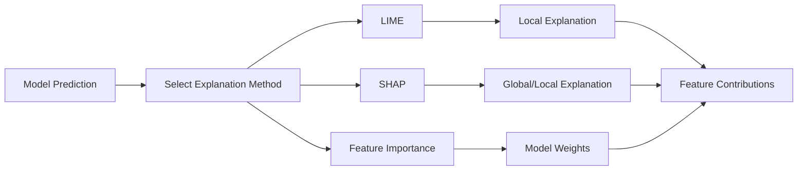

# Interpretability Analysis
{: .no_toc }

Understanding model predictions through LIME, SHAP, and feature importance analysis to explain why models make specific decisions.
{: .fs-6 .fw-300 }

## Table of contents
{: .no_toc .text-delta }

1. TOC
{:toc}

---

## Overview

### What is Interpretability?

**Interpretability** (also called **explainability**) is the ability to understand and explain why a model makes specific predictions. It helps answer questions like:
- "Why did the model predict this user will click?"
- "Which features are most important for this prediction?"
- "How do different features interact to influence the prediction?"

**Key Concept**:
- **Black Box**: Models that make predictions without clear explanations
- **Interpretable Models**: Models whose predictions can be understood
- **Post-Hoc Explanation**: Methods to explain predictions after they're made

### Why Interpretability Matters

**Business Value**:
- **Trust**: Users and stakeholders trust models they understand
- **Debugging**: Identify and fix model issues
- **Compliance**: Meet regulatory requirements for explainable AI
- **Insights**: Discover business insights from model behavior

**Technical Benefits**:
- **Model Validation**: Verify model is learning correct patterns
- **Feature Engineering**: Identify which features matter most
- **Bias Detection**: Discover potential biases in model decisions
- **Improvement**: Use insights to improve model design

### How It Works

**Interpretability Analysis Workflow**:



**Process**:
1. **Select Method**: Choose LIME, SHAP, or feature importance
2. **Generate Explanation**: Compute feature contributions
3. **Visualize**: Display which features drive the prediction
4. **Interpret**: Understand model reasoning

---

## Supported Methods

### 1. LIME (Local Interpretable Model-agnostic Explanations)

**Overview**:
LIME explains individual predictions by training a simple, interpretable model (e.g., linear) on perturbed versions of the input around the prediction of interest.

**Key Features**:
- **Local Explanations**: Explains single predictions, not the whole model
- **Model-Agnostic**: Works with any machine learning model
- **Feature Importance**: Shows which features most influence this specific prediction
- **Intuitive**: Easy to understand explanations

**How It Works**:
1. **Perturb Input**: Create variations of the input sample
2. **Get Predictions**: Use the model to predict on perturbed samples
3. **Train Simple Model**: Fit a linear model to approximate model behavior locally
4. **Extract Weights**: Feature weights in the linear model show importance

**Mathematical Formulation**:

LIME finds an interpretable model $g$ that approximates the complex model $f$ locally around instance $x$:

$$
\xi(x) = \underset{g \in G}{\arg\min} \mathcal{L}(f, g, \pi_x) + \Omega(g)
$$

Where:
- $f$: The complex model being explained
- $g$: The interpretable model (e.g., linear model)
- $G$: Class of interpretable models
- $\pi_x$: Proximity measure (how close perturbed samples are to $x$)
- $\mathcal{L}(f, g, \pi_x)$: Loss function measuring how well $g$ approximates $f$ in the neighborhood of $x$
- $\Omega(g)$: Complexity penalty (simpler models preferred)

**Loss Function**:

$$
\mathcal{L}(f, g, \pi_x) = \sum_{z \in Z} \pi_x(z) \left( f(z) - g(z') \right)^2
$$

Where:
- $Z$: Set of perturbed samples around $x$
- $z$: A perturbed sample
- $z'$: Binary representation of $z$ (which features are present)
- $\pi_x(z)$: Weight based on proximity to $x$ (closer samples weighted more)

**Intuitive Explanation**:
- LIME finds a simple model that matches the complex model's predictions near the instance of interest
- Features with larger coefficients in $g$ are more important for this specific prediction
- The proximity weight ensures we focus on samples similar to the original instance

**When to Use**:
- ✅ Need to explain specific predictions
- ✅ Model is complex (neural networks, ensembles)
- ✅ Want intuitive, easy-to-understand explanations

**Limitations**:
- ❌ Only explains local behavior, not global patterns
- ❌ Can be unstable (small input changes → different explanations)
- ❌ Computationally expensive for large datasets

### 2. SHAP (SHapley Additive exPlanations)

**Overview**:
SHAP provides theoretically grounded explanations based on **Shapley values** from cooperative game theory. It explains how each feature contributes to a prediction.

**Key Features**:
- **Theoretical Foundation**: Based on Shapley values (fair allocation in game theory)
- **Global & Local**: Can explain both individual predictions and overall model behavior
- **Feature Interactions**: Reveals how features interact to influence predictions
- **Consistency**: Satisfies desirable mathematical properties

**How It Works**:
1. **Shapley Values**: Calculate each feature's marginal contribution
2. **All Possible Coalitions**: Consider all combinations of features
3. **Fair Allocation**: Distribute prediction value fairly among features
4. **Additive**: Feature contributions sum to the prediction

**Mathematical Formulation**:

SHAP values are based on **Shapley values** from cooperative game theory. For a model $f$ and instance $x$, the SHAP value for feature $i$ is:

$$
\phi_i(f, x) = \sum_{S \subseteq F \setminus \{i\}} \frac{|S|! (|F| - |S| - 1)!}{|F|!} \left[ f(S \cup \{i\}) - f(S) \right]
$$

Where:
- $F$: Set of all features
- $S$: A subset of features (coalition)
- $f(S)$: Model prediction using only features in $S$
- $|S|$: Number of features in subset $S$
- $|F|$: Total number of features

**Additivity Property**:

SHAP values satisfy the additivity property:

$$
f(x) = \phi_0 + \sum_{i=1}^{M} \phi_i
$$

Where:
- $\phi_0$: Base value (expected model output)
- $\phi_i$: SHAP value for feature $i$
- $M$: Number of features

**Understanding the Formula**:

1. **Marginal Contribution**: $f(S \cup \{i\}) - f(S)$ measures how much feature $i$ adds when included in coalition $S$
2. **Weighted Average**: The formula averages marginal contributions across all possible coalitions
3. **Fair Allocation**: Each feature gets credit proportional to its average contribution
4. **Efficiency**: All SHAP values sum to the prediction minus the base value

**Intuitive Explanation**:
- SHAP values fairly distribute the prediction value among features
- A positive SHAP value means the feature increases the prediction
- A negative SHAP value means the feature decreases the prediction
- The magnitude indicates the feature's importance

**When to Use**:
- ✅ Need theoretically sound explanations
- ✅ Want both local and global insights
- ✅ Need to understand feature interactions
- ✅ Require consistent explanations

**Advantages**:
- ✅ Strong theoretical foundation
- ✅ Handles feature interactions
- ✅ Consistent and reliable

**Limitations**:
- ❌ Computationally expensive (exponential in number of features)
- ❌ Can be slow for large models/datasets
- ❌ More complex to understand than LIME

### 3. Feature Importance (Model-Specific)

**Overview**:
Some models (like Logistic Regression) have built-in feature importance through their learned weights. This method directly extracts these weights.

**Key Features**:
- **Direct Extraction**: No additional computation needed
- **Fast**: Instant results for linear models
- **Model-Specific**: Only works for models with interpretable weights
- **Global View**: Shows overall feature importance, not per-prediction

**How It Works**:
1. **Extract Weights**: Get feature coefficients from trained model
2. **Normalize**: Optionally normalize for comparison
3. **Rank**: Sort features by absolute weight
4. **Display**: Show most important features

**When to Use**:
- ✅ Using linear models (Logistic Regression, Linear Regression)
- ✅ Need quick, global feature importance
- ✅ Want model-native explanations

**Limitations**:
- ❌ Only works for models with interpretable weights
- ❌ Doesn't explain individual predictions
- ❌ May miss non-linear relationships

---

## Usage Guide

### Basic Usage

1. Navigate to the "📊 Data Collection & Training" tab
2. Switch to the "🔍 Interpretability Analysis" sub-tab
3. **Select Explanation Method**:
   - **LIME**: For local, intuitive explanations
   - **SHAP**: For theoretically sound, comprehensive explanations
   - **Feature Importance**: For quick, global importance (linear models only)
4. **Configure Parameters**:
   - **Number of Features**: How many top features to display (5-20)
   - **Sample Selection**: Choose specific samples to explain (for LIME/SHAP)
5. **Run Analysis**: Click "🔍 Analyze Model Interpretability" button
6. **View Results**:
   - Feature importance rankings
   - Contribution values (how much each feature contributes)
   - Visualizations (bar charts, waterfall plots)

### Interpreting Results

**LIME Results**:
- **Feature Weights**: Positive = increases prediction, Negative = decreases
- **Magnitude**: Larger absolute value = stronger influence
- **Top Features**: Focus on features with largest weights

**SHAP Results**:
- **SHAP Values**: Feature contributions (can be positive or negative)
- **Base Value**: Model's average prediction
- **Sum**: Base value + SHAP values = actual prediction
- **Feature Interactions**: Can show how features interact

**Feature Importance Results**:
- **Coefficients**: Feature weights from the model
- **Sign**: Positive = increases prediction, Negative = decreases
- **Magnitude**: Larger absolute value = more important feature

---

## Application Scenarios

### Understanding Model Decisions

**Use Case**: "Why did the model predict this user will click on this document?"

**Approach**:
- Use LIME or SHAP to explain the specific prediction
- Identify which features (user history, query match, position) drove the decision
- Verify the reasoning makes business sense

### Feature Engineering

**Use Case**: "Which features should I focus on improving?"

**Approach**:
- Use feature importance or SHAP global importance
- Identify top contributing features
- Prioritize feature engineering efforts on important features

### Model Debugging

**Use Case**: "The model is making unexpected predictions. Why?"

**Approach**:
- Use LIME/SHAP on problematic predictions
- Check if model is using correct features
- Identify if model learned spurious correlations

### Business Communication

**Use Case**: "Explain model decisions to non-technical stakeholders."

**Approach**:
- Use LIME for intuitive, easy-to-understand explanations
- Focus on top contributing features
- Translate technical explanations to business language

### Bias Detection

**Use Case**: "Is the model making biased decisions?"

**Approach**:
- Use SHAP to analyze predictions across different groups
- Check if certain features (e.g., position, category) have disproportionate influence
- Identify potential sources of bias

---

## Technical Implementation

### LIME Implementation

```python
from lime.lime_tabular import LimeTabularExplainer

# Create LIME explainer
explainer = LimeTabularExplainer(
    training_data=X_train,
    feature_names=feature_names,
    mode='classification'
)

# Explain a single prediction
explanation = explainer.explain_instance(
    data_row=X_test[0],
    predict_fn=model.predict_proba,
    num_features=10
)

# Get feature importance
feature_importance = explanation.as_list()
```

### SHAP Implementation

```python
import shap

# Create SHAP explainer
explainer = shap.Explainer(model, X_train)

# Calculate SHAP values
shap_values = explainer(X_test[:100])  # Explain first 100 samples

# Visualize
shap.plots.bar(shap_values)  # Global feature importance
shap.plots.waterfall(shap_values[0])  # Single prediction explanation
```

### Feature Importance Implementation

```python
# For Logistic Regression
feature_importance = {
    'feature_name': model.coef_[0],
    'abs_importance': np.abs(model.coef_[0])
}

# Sort by absolute importance
sorted_features = sorted(
    feature_importance.items(),
    key=lambda x: x[1]['abs_importance'],
    reverse=True
)
```

---

## Best Practices

### Method Selection

- **Quick Overview**: Use feature importance for linear models
- **Individual Explanations**: Use LIME for intuitive, local explanations
- **Comprehensive Analysis**: Use SHAP for thorough, theoretically sound analysis
- **Production Systems**: Consider computational cost (LIME/SHAP can be slow)

### Interpretation Guidelines

- **Focus on Top Features**: Don't try to interpret every feature
- **Consider Context**: Feature importance may vary by context
- **Verify with Domain Knowledge**: Check if explanations make business sense
- **Look for Patterns**: Identify consistent patterns across explanations

### Communication

- **Simplify**: Translate technical explanations to business language
- **Visualize**: Use charts and graphs to make explanations clear
- **Provide Context**: Explain what features mean in business terms
- **Highlight Surprises**: Point out unexpected or interesting findings

---

## Troubleshooting

### LIME/SHAP Too Slow

**Problem**: Interpretability analysis takes too long.

**Solutions**:
- **Sample Data**: Explain a subset of predictions, not all
- **Reduce Features**: Limit number of features to explain
- **Use Approximations**: Use faster SHAP approximations (e.g., TreeSHAP)
- **Feature Importance**: Use feature importance for quick results

### Unstable Explanations

**Problem**: LIME gives different explanations for similar inputs.

**Possible Causes**:
- LIME's random sampling
- Model instability
- Small perturbations

**Solutions**:
- Use SHAP for more stable explanations
- Average multiple LIME runs
- Check model stability

### Difficult to Interpret

**Problem**: Explanations are too technical or unclear.

**Solutions**:
- Focus on top contributing features
- Translate feature names to business terms
- Use visualizations (bar charts, waterfall plots)
- Provide context and examples

---

## Related Resources

- [LIME Paper](https://arxiv.org/abs/1602.04938)
- [SHAP Paper](https://arxiv.org/abs/1705.07874)
- [Interpretable Machine Learning Book](https://christophm.github.io/interpretable-ml-book/)
- [SHAP Documentation](https://shap.readthedocs.io/)
- [LIME Documentation](https://github.com/marcotcr/lime)
