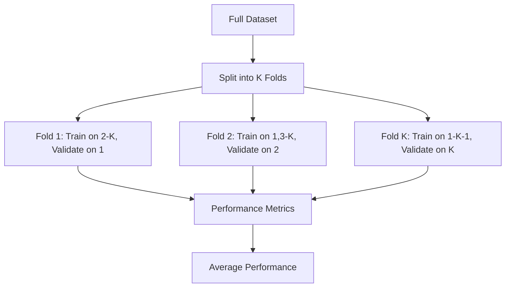

# Model Evaluation
{: .no_toc }

K-fold cross-validation for assessing model generalization performance across different data subsets.
{: .fs-6 .fw-300 }

## Table of contents
{: .no_toc .text-delta }

1. TOC
{:toc}

---

## Overview

### What is Model Evaluation?

Model evaluation is the process of assessing how well a trained model performs on unseen data. This system uses **K-fold cross-validation** to estimate model performance by testing on multiple data splits.

**Key Concept**:
- **Training Set**: Data used to train the model
- **Validation Set**: Data used to evaluate model during training
- **Test Set**: Data used for final performance assessment
- **Cross-Validation**: Rotating which data serves as training vs. validation

### Why Model Evaluation Matters

**Problem with Single Train/Test Split**:
- ❌ Performance estimate depends on specific data split
- ❌ May overestimate or underestimate true performance
- ❌ Doesn't reveal model stability across different data

**Benefits of K-Fold Cross-Validation**:
- ✅ **Robust Estimates**: Average performance across multiple splits
- ✅ **Variance Assessment**: Understand performance variability
- ✅ **Better Generalization**: More reliable estimate of real-world performance
- ✅ **Data Efficiency**: Use all data for both training and validation

### How It Works

**K-Fold Cross-Validation Process**:



**Process**:
1. **Split Data**: Divide dataset into K equal folds
2. **Iterate**: For each fold:
   - Train on K-1 folds
   - Validate on the remaining fold
   - Record performance metrics
3. **Aggregate**: Calculate average and standard deviation of metrics

---

## Features

### Core Capabilities

- **Stratified K-Fold**: Maintains class distribution in each fold (handles imbalanced data)
- **Comprehensive Metrics**: Multiple evaluation metrics for thorough assessment
- **Statistical Summary**: Mean, standard deviation, and confidence intervals
- **Visualization**: Performance charts and comparison graphs

### Evaluation Metrics

The system computes the following metrics for each fold:

| Metric | Description | Range |
|:-------|:-----------|:------|
| **Accuracy** | Proportion of correct predictions | 0-1 (higher is better) |
| **Precision** | Proportion of positive predictions that are correct | 0-1 (higher is better) |
| **Recall** | Proportion of actual positives correctly identified | 0-1 (higher is better) |
| **F1-Score** | Harmonic mean of precision and recall | 0-1 (higher is better) |
| **AUC** | Area under the ROC curve | 0-1 (higher is better) |

**Why Multiple Metrics?**
- **Accuracy**: Overall correctness, but can be misleading with imbalanced data
- **Precision**: Important when false positives are costly
- **Recall**: Important when false negatives are costly
- **F1-Score**: Balanced measure when both precision and recall matter
- **AUC**: Overall ranking quality, independent of threshold

---

## Usage Guide

### Basic Usage

1. Navigate to the "📊 Data Collection & Training" tab
2. Switch to the "📊 Cross-Validation" sub-tab
3. **Configure Parameters**:
   - **Number of Folds**: Choose K (typically 3-10)
     - More folds = more robust but slower
     - Fewer folds = faster but less robust
   - **Model Type**: Select the model to evaluate (Logistic Regression or Wide & Deep)
4. **Run Evaluation**: Click "🚀 Execute Cross-Validation" button
5. **View Results**:
   - Performance metrics for each fold
   - Average performance across all folds
   - Standard deviation (indicates stability)

### Interpreting Results

**Good Results**:
- ✅ High average metrics (e.g., AUC > 0.8)
- ✅ Low standard deviation (consistent performance across folds)
- ✅ Similar performance across all metrics

**Warning Signs**:
- ⚠️ High variance (large standard deviation) → Model may be unstable
- ⚠️ Low average performance → Model may need improvement
- ⚠️ Large gap between metrics → May indicate data issues

---

## Technical Implementation

### Stratified K-Fold

**Why Stratified?**
- Ensures each fold has the same proportion of positive/negative samples
- Prevents bias from imbalanced data distribution
- More reliable for classification tasks

**Implementation**:
```python
from sklearn.model_selection import StratifiedKFold, cross_val_score
from sklearn.metrics import make_scorer, roc_auc_score

# Create stratified k-fold splitter
skf = StratifiedKFold(n_splits=5, shuffle=True, random_state=42)

# Perform cross-validation
cv_scores = cross_val_score(
    model,
    X, y,
    cv=skf,
    scoring='roc_auc',
    n_jobs=-1
)

# Calculate statistics
mean_score = cv_scores.mean()
std_score = cv_scores.std()
```

### Multiple Metrics

The system evaluates multiple metrics simultaneously:

```python
from sklearn.metrics import (
    accuracy_score, precision_score, recall_score,
    f1_score, roc_auc_score
)

def evaluate_fold(y_true, y_pred, y_pred_proba):
    """Evaluate a single fold with multiple metrics"""
    return {
        'accuracy': accuracy_score(y_true, y_pred),
        'precision': precision_score(y_true, y_pred),
        'recall': recall_score(y_true, y_pred),
        'f1': f1_score(y_true, y_pred),
        'auc': roc_auc_score(y_true, y_pred_proba)
    }
```

---

## Best Practices

### Choosing K (Number of Folds)

- **K=3-5**: Faster, good for large datasets
- **K=5-10**: Standard choice, good balance
- **K=10+**: More robust but slower, good for small datasets

**Rule of Thumb**: Use K=5 or K=10 for most cases.

### Data Preparation

- **Shuffle Data**: Randomize before splitting (handled by `shuffle=True`)
- **Handle Missing Values**: Clean data before evaluation
- **Feature Scaling**: Normalize features if using distance-based models
- **Stratification**: Always use stratified splits for classification

### Performance Interpretation

- **Look at Both Mean and Std**: High mean + low std = good and stable
- **Compare Across Models**: Use same K and same data splits for fair comparison
- **Consider Business Context**: Which metric matters most for your use case?

---

## Troubleshooting

### High Variance Across Folds

**Problem**: Large standard deviation in performance metrics.

**Possible Causes**:
- Insufficient data (folds too small)
- Data distribution issues
- Model instability

**Solutions**:
- Increase dataset size
- Check for data quality issues
- Try different models or regularization

### Low Average Performance

**Problem**: Average metrics are consistently low.

**Possible Causes**:
- Model too simple for the problem
- Poor feature engineering
- Data quality issues

**Solutions**:
- Try more complex models
- Improve feature engineering
- Review and clean data
- Check for data leakage

### Inconsistent Metrics

**Problem**: Some metrics are high while others are low.

**Possible Causes**:
- Class imbalance
- Threshold selection
- Metric-specific issues

**Solutions**:
- Use stratified cross-validation
- Adjust classification threshold
- Focus on metrics relevant to your use case

---

## Related Resources

- [Cross-Validation Explained](https://scikit-learn.org/stable/modules/cross_validation.html)
- [Model Evaluation Metrics](https://scikit-learn.org/stable/modules/model_evaluation.html)
- [Stratified K-Fold](https://scikit-learn.org/stable/modules/generated/sklearn.model_selection.StratifiedKFold.html)
