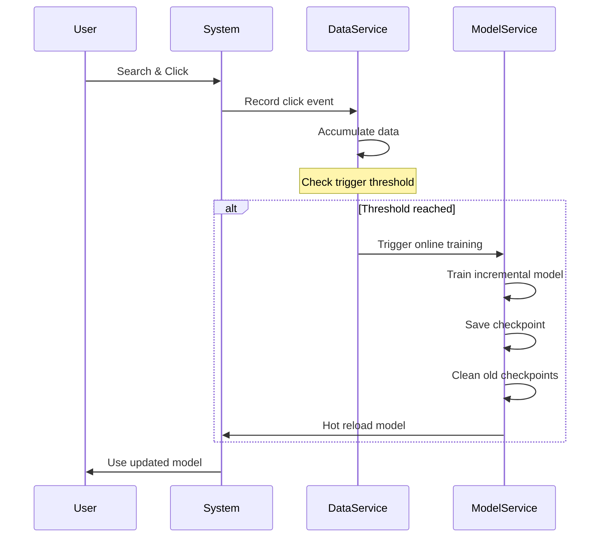

# Online Learning for CTR Models
{: .no_toc }

Continuous model improvement through automatic retraining on new click data.
{: .fs-6 .fw-300 }

## Table of contents
{: .no_toc .text-delta }

1. TOC
{:toc}

---

## Overview

### What is Online Learning?

**Online Learning** enables CTR models to continuously improve by automatically retraining on newly collected click data. Unlike traditional batch training, online learning allows the model to adapt to changing user behavior patterns in real-time.

**Key Concepts**:
- **Incremental Training**: Model updates with new data without full retraining
- **Automatic Triggers**: Training starts automatically when enough new data arrives
- **Model Versioning**: Separate checkpoints for online and offline models
- **Hot Reloading**: Seamless model updates without service interruption

### Why Online Learning?

**Business Benefits**:
1. **Real-time Adaptation**: Model adapts to current user preferences
2. **Improved Accuracy**: Continuous learning improves prediction quality
3. **Reduced Staleness**: Model stays current with latest trends
4. **Automated Pipeline**: No manual intervention needed

**Technical Benefits**:
- **Data Efficiency**: Leverage every user interaction immediately
- **Incremental Updates**: No need to retrain from scratch
- **Lower Latency**: Smaller training batches complete faster
- **Easy Rollback**: Keep multiple checkpoint versions

---

## Architecture

### Training Modes

The system supports two training modes that can run in parallel:

| Mode | Trigger | Data | Model Path | Checkpoints | Use Case |
|:-----|:--------|:-----|:-----------|:------------|:---------|
| **Offline** | Manual | Full dataset | `models/ctr_offline/` | All versions | Baseline, major updates |
| **Online** | Automatic | Incremental | `models/ctr_online/` | Last 5 only | Continuous improvement |

### Workflow



### Key Components

**1. Data Service**:
- Monitors incoming click events
- Counts new samples since last training
- Triggers online training automatically

**2. Model Service**:
- Maintains separate online/offline model directories
- Manages checkpoint numbering and cleanup
- Handles hot reloading of updated models

**3. Configuration**:
- Enable/disable online learning
- Set training trigger threshold
- Configure checkpoint retention policy

---

## Configuration

### Enable Online Learning

**In Web UI**:

1. Navigate to **"📊 第六部分：数据回收训练"** tab
2. Find **"🔄 在线学习配置"** section
3. Toggle **"启用在线学习"** checkbox
4. Set **"触发阈值"** (default: 100 new samples)
5. System will now train automatically

**Configuration Options**:

```python
{
    "online_learning_enabled": True,      # Enable/disable online learning
    "online_training_threshold": 100,     # Number of new samples to trigger training
    "checkpoint_retention": 5,            # Keep last N online checkpoints
    "model_prefix": "ctr_model_online"    # Online model file prefix
}
```

### Training Trigger Logic

**Automatic Trigger**:
- DataService tracks `last_training_data_count`
- On each new click, checks if `current_count - last_training_data_count >= threshold`
- If threshold exceeded, triggers `ModelService.train_model()` in background thread

**Code Example**:
```python
def record_click(self, query, doc_id, position, clicked):
    """Record click event and trigger online training if needed"""
    # Save click data
    sample = self._create_sample(query, doc_id, position, clicked)
    self.samples.append(sample)
    
    # Check online learning trigger
    if self.online_learning_enabled:
        current_count = len(self.samples)
        if current_count - self.last_training_data_count >= self.online_training_threshold:
            print(f"🔄 触发在线训练 (新增 {current_count - self.last_training_data_count} 条样本)")
            self._trigger_online_training()
```

---

## Model Management

### Directory Structure

```
models/
├── ctr_offline/                    # Offline models (manual training)
│   ├── ctr_model_v1.pkl
│   ├── ctr_model_v2.pkl
│   └── ctr_model_v3.pkl
│
└── ctr_online/                     # Online models (automatic training)
    ├── ctr_model_online_001.pkl    # Oldest
    ├── ctr_model_online_002.pkl
    ├── ctr_model_online_003.pkl
    ├── ctr_model_online_004.pkl
    └── ctr_model_online_005.pkl    # Latest (active)
```

### Checkpoint Numbering

**Automatic Numbering**:
- Online checkpoints use sequential numbers: `001`, `002`, `003`, ...
- Numbers auto-increment with each training
- Format: `ctr_model_online_{number:03d}.pkl`

**Cleanup Policy**:
- Keep only the last N checkpoints (default: 5)
- Older checkpoints are automatically deleted
- Prevents disk space exhaustion

### Hot Reloading

**Seamless Model Updates**:
```python
def train_model(self, model_type='logistic', is_online=False):
    """Train model with hot reloading"""
    # Train new model
    new_model = self._train(X, y)
    
    # Save to appropriate directory
    if is_online:
        model_path = self._save_online_checkpoint(new_model)
        self._cleanup_old_checkpoints()
    else:
        model_path = self._save_offline_model(new_model)
    
    # Hot reload: update active model
    self.model = new_model
    self.current_model_path = model_path
    
    print(f"✅ 模型已更新并自动加载: {model_path}")
```

---

## Usage Guide

### Setup Online Learning

**Step 1: Enable Feature**

1. Open Web UI → **"数据回收训练"** tab
2. Expand **"🔄 在线学习配置"** section
3. Check **"启用在线学习"**
4. Set threshold (e.g., 100 samples)

**Step 2: Collect Data**

1. Navigate to **"🔍 在线检索与排序"** tab
2. Perform searches and interact with results
3. System automatically records clicks
4. Monitor sample count in **"数据管理"** section

**Step 3: Automatic Training**

- Training triggers automatically when threshold is reached
- Check terminal output for training logs:
  ```
  🔄 触发在线训练 (新增 102 条样本)
  📊 开始训练 CTR 模型...
  ✅ 模型训练完成: models/ctr_online/ctr_model_online_006.pkl
  🗑️ 清理旧检查点: ctr_model_online_001.pkl
  ✅ 模型已更新并自动加载
  ```

**Step 4: Verify Model**

- New searches automatically use the updated model
- Compare rankings before/after training
- Monitor performance in evaluation metrics

### Monitor Online Learning

**Training Status**:
- Check terminal logs for training triggers
- Monitor model version in use
- Track performance metrics over time

**Sample Count**:
```
📊 数据统计
- 总样本数: 1,234
- 正样本数: 156 (点击)
- 负样本数: 1,078 (未点击)
- 上次训练: 1,132 样本
- 距离触发: 66 样本 (阈值: 100)
```

---

## Best Practices

### Threshold Selection

**Choosing the Right Threshold**:

| Threshold | Training Frequency | Use Case |
|:----------|:-------------------|:---------|
| 50-100 | High (frequent) | High-traffic systems, rapid adaptation |
| 100-500 | Medium | Balanced approach, general use |
| 500-1000 | Low (stable) | Low-traffic systems, stable patterns |

**Considerations**:
- **Too Low**: Frequent training, may overfit to noise
- **Too High**: Slow adaptation, miss recent trends
- **Recommended**: Start with 100, adjust based on traffic

### Data Quality

**Ensure Quality Training Data**:
1. **Sufficient Volume**: At least 50-100 samples per training
2. **Balance**: Mix of positive and negative samples
3. **Diversity**: Represent different queries and documents
4. **Freshness**: Recent data reflects current patterns

### Model Monitoring

**Track Key Metrics**:
1. **Training Frequency**: How often models are updated
2. **Model Performance**: AUC, accuracy trends over time
3. **Checkpoint Count**: Ensure old checkpoints are cleaned
4. **Disk Usage**: Monitor online model directory size

---

## Troubleshooting

### Training Not Triggering

**Problem**: Online learning enabled but no automatic training

**Solutions**:
1. **Check Threshold**: Verify threshold is reasonable for traffic level
2. **Check Sample Count**: Ensure enough new samples accumulated
3. **Check Logs**: Look for error messages in terminal
4. **Manual Test**: Try manual training to verify system works

### Model Not Updating

**Problem**: Training completes but model not updating

**Solutions**:
1. **Check Hot Reload**: Verify model service reloads after training
2. **Check File Path**: Ensure model file saved correctly
3. **Restart Service**: Reload model service if needed
4. **Check Logs**: Look for hot reload success messages

### Disk Space Issues

**Problem**: Too many checkpoints consuming disk space

**Solutions**:
1. **Reduce Retention**: Lower checkpoint retention count
2. **Manual Cleanup**: Delete old online checkpoints manually
3. **Monitor Usage**: Set up disk space alerts
4. **Archive**: Move old models to archive storage

---

## Advanced Topics

### Incremental vs. Full Training

**Current Implementation**: Full training with latest data
- Simple and reliable
- No catastrophic forgetting
- Good for moderate data volumes

**Future Enhancement**: True incremental training
- Update model with only new data
- Faster training for large datasets
- Requires careful handling of model state

### Multi-Model Strategy

**A/B Testing**:
- Keep multiple online model versions
- Route traffic to different models
- Compare performance metrics
- Deploy best-performing model

**Ensemble Learning**:
- Combine predictions from multiple models
- Offline model (stable) + Online model (adaptive)
- Weighted average or stacking

---

## Related Resources

- [CTR Prediction Models]({{ site.baseurl }}/docs/search-recommendation/ctr-prediction) - Model architectures
- [Model Evaluation]({{ site.baseurl }}/docs/search-recommendation/model-evaluation) - Performance metrics
- [Data Collection]({{ site.baseurl }}/docs/search-recommendation/data-collection) - Sample management

