# 🛠️ 工具模块 - 三部分架构验证工具集

搜索引擎测试床三部分架构的验证工具集，为Portal提供系统监控、数据质量检查、性能监控等验证功能

## 🎯 模块定位

**验证工具集** - 为三部分架构提供全面的验证工具，包括系统监控、数据质量检查、性能监控、演示数据生成等

## 📁 文件结构

```
tools/
├── sre_monitor.py           # 🛡️ 系统可靠性监控
├── data_quality_checker.py  # 📊 数据质量检查
├── performance_monitor.py   # ⚡ 性能监控
├── demo_data_generator.py   # 🎯 演示数据生成
├── reset_system.py          # 🔄 系统重置
└── README.md                # 模块说明文档
```

## 🛡️ 系统可靠性监控

### 核心文件：`sre_monitor.py`

**功能定位**：为Portal提供系统可靠性监控，验证三部分架构的系统健康度

**主要职责**：
- 系统资源监控（CPU、内存、磁盘）
- 数据质量监控
- 性能指标监控
- 错误日志监控

**核心方法**：
```python
class SREMonitor:
    def __init__(self):
        self.metrics = {}
        self.alerts = []
    
    def check_system_health(self) -> Dict:
        """检查系统健康度"""
        # 1. CPU使用率检查
        # 2. 内存使用率检查
        # 3. 磁盘空间检查
        # 4. 网络连接检查
    
    def check_data_quality(self) -> Dict:
        """检查数据质量"""
        # 1. 索引数据完整性
        # 2. 用户行为数据质量
        # 3. 模型数据有效性
    
    def check_performance(self) -> Dict:
        """检查性能指标"""
        # 1. 查询响应时间
        # 2. 模型训练时间
        # 3. 系统吞吐量
    
    def generate_report(self) -> Dict:
        """生成监控报告"""
        # 综合所有监控指标生成报告
```

**与Portal的交互**：
- Portal调用`generate_report()`获取监控报告
- Portal显示系统健康度指标
- Portal触发告警和通知

## 📊 数据质量检查

### 核心文件：`data_quality_checker.py`

**功能定位**：为Portal提供数据质量检查，验证三部分架构的数据完整性

**主要职责**：
- 索引数据质量检查
- 用户行为数据质量检查
- 模型数据质量检查
- 数据一致性验证

**核心方法**：
```python
class DataQualityChecker:
    def check_index_quality(self) -> Dict:
        """检查索引数据质量"""
        # 1. 文档覆盖率检查
        # 2. 索引完整性检查
        # 3. 词项分布检查
    
    def check_behavior_quality(self) -> Dict:
        """检查用户行为数据质量"""
        # 1. 数据完整性检查
        # 2. 数据一致性检查
        # 3. 异常数据检测
    
    def check_model_quality(self) -> Dict:
        """检查模型数据质量"""
        # 1. 模型文件完整性
        # 2. 特征数据质量
        # 3. 预测结果合理性
    
    def generate_quality_report(self) -> Dict:
        """生成数据质量报告"""
        # 综合所有质量检查结果
```

**与Portal的交互**：
- Portal调用`generate_quality_report()`获取质量报告
- Portal显示数据质量指标
- Portal提供数据修复建议

## ⚡ 性能监控

### 核心文件：`performance_monitor.py`

**功能定位**：为Portal提供性能监控，验证三部分架构的性能表现

**主要职责**：
- 查询性能监控
- 模型训练性能监控
- 系统资源性能监控
- 性能瓶颈分析

**核心方法**：
```python
class PerformanceMonitor:
    def monitor_query_performance(self) -> Dict:
        """监控查询性能"""
        # 1. 响应时间统计
        # 2. 吞吐量统计
        # 3. 错误率统计
    
    def monitor_training_performance(self) -> Dict:
        """监控训练性能"""
        # 1. 训练时间统计
        # 2. 内存使用统计
        # 3. 模型收敛性分析
    
    def monitor_system_performance(self) -> Dict:
        """监控系统性能"""
        # 1. CPU使用率
        # 2. 内存使用率
        # 3. 磁盘I/O性能
    
    def generate_performance_report(self) -> Dict:
        """生成性能报告"""
        # 综合所有性能指标
```

**与Portal的交互**：
- Portal调用`generate_performance_report()`获取性能报告
- Portal显示性能指标和趋势
- Portal提供性能优化建议

## 🎯 演示数据生成

### 核心文件：`demo_data_generator.py`

**功能定位**：为Portal提供演示数据生成，支持三部分架构的快速验证

**主要职责**：
- 生成测试文档数据
- 生成用户行为数据
- 生成模型训练数据
- 支持快速重置和重建

**核心方法**：
```python
class DemoDataGenerator:
    def generate_documents(self, count: int = 100) -> Dict[str, str]:
        """生成测试文档"""
        # 生成中文测试文档
    
    def generate_user_behavior(self, query_count: int = 50) -> List[Dict]:
        """生成用户行为数据"""
        # 生成模拟的用户点击行为
    
    def generate_training_data(self) -> Dict:
        """生成训练数据"""
        # 生成CTR模型训练数据
    
    def reset_demo_data(self):
        """重置演示数据"""
        # 清空所有演示数据并重新生成
```

**与Portal的交互**：
- Portal调用`reset_demo_data()`重置演示环境
- Portal使用生成的测试数据进行验证
- Portal支持快速重建测试环境

## 🔄 系统重置

### 核心文件：`reset_system.py`

**功能定位**：为Portal提供系统重置功能，支持三部分架构的快速重建

**主要职责**：
- 清空所有数据
- 重新构建索引
- 重新训练模型
- 重置监控状态

**核心方法**：
```python
class SystemResetter:
    def clear_all_data(self):
        """清空所有数据"""
        # 清空索引、行为数据、模型数据
    
    def rebuild_index(self):
        """重新构建索引"""
        # 重新构建倒排索引
    
    def retrain_model(self):
        """重新训练模型"""
        # 重新训练CTR模型
    
    def reset_system(self):
        """重置整个系统"""
        # 完整的系统重置流程
```

**与Portal的交互**：
- Portal调用`reset_system()`进行系统重置
- Portal显示重置进度和结果
- Portal支持选择性重置

## 🔄 验证流程

### 三部分架构验证

```mermaid
flowchart LR
    A[Portal调用] --> B[工具模块]
    B --> C[SRE监控]
    B --> D[数据质量检查]
    B --> E[性能监控]
    B --> F[演示数据生成]
    B --> G[系统重置]
    
    C --> H[系统健康度报告]
    D --> I[数据质量报告]
    E --> J[性能指标报告]
    F --> K[测试数据]
    G --> L[重置结果]
    
    H --> M[Portal显示]
    I --> M
    J --> M
    K --> M
    L --> M
    
    style A fill:#ff6b6b
    style B fill:#ff9ff3
    style M fill:#4ecdc4
```



### 验证工具集成

```mermaid
sequenceDiagram
    participant P as Portal
    participant S as SREMonitor
    participant D as DataQualityChecker
    participant PM as PerformanceMonitor
    participant DG as DemoDataGenerator
    participant SR as SystemResetter
    
    P->>S: 检查系统健康度
    S->>P: 返回健康度报告
    
    P->>D: 检查数据质量
    D->>P: 返回质量报告
    
    P->>PM: 监控性能指标
    PM->>P: 返回性能报告
    
    P->>DG: 生成演示数据
    DG->>P: 返回测试数据
    
    P->>SR: 重置系统
    SR->>P: 返回重置结果
```



## 🚀 快速验证

### 1. 系统监控验证
```python
# Portal调用示例
monitor = SREMonitor()
report = monitor.generate_report()
print(f"系统健康度: {report['health_score']}")
print(f"告警数量: {len(report['alerts'])}")
```

### 2. 数据质量验证
```python
# Portal调用示例
checker = DataQualityChecker()
quality_report = checker.generate_quality_report()
print(f"数据质量评分: {quality_report['overall_score']}")
```

### 3. 性能监控验证
```python
# Portal调用示例
perf_monitor = PerformanceMonitor()
perf_report = perf_monitor.generate_performance_report()
print(f"平均响应时间: {perf_report['avg_response_time']}ms")
```

### 4. 演示数据验证
```python
# Portal调用示例
generator = DemoDataGenerator()
documents = generator.generate_documents(50)
behavior_data = generator.generate_user_behavior(20)
```

## 🔧 扩展开发

### 添加新监控
1. 在对应的监控类中添加新方法
2. 更新报告生成逻辑
3. 在Portal中集成新监控

### 添加新检查
1. 在`data_quality_checker.py`中添加新检查
2. 更新质量评估逻辑
3. 在Portal中显示新检查结果

### 添加新工具
1. 创建新的工具类
2. 实现工具功能
3. 在Portal中集成新工具

## 📊 验证重点

### 监控验证
- 监控指标的准确性
- 告警机制的及时性
- 报告生成的完整性

### 质量验证
- 数据质量检查的全面性
- 问题检测的准确性
- 修复建议的有效性

### 性能验证
- 性能指标的合理性
- 瓶颈分析的准确性
- 优化建议的可行性

## 🔗 相关模块

- **Portal入口**: `ui/portal.py`
- **离线索引**: `offline/offline_index.py`
- **搜索引擎**: `online/search_engine.py`
- **数据收集**: `online/ctr_collector.py`
- **模型训练**: `online/ctr_model.py`

## 📋 在三部分架构中的位置

### 验证工具集
作为三部分架构的验证工具集，工具模块承担以下重要职责：

1. **全面监控**: 监控三部分架构的系统健康度
2. **质量保障**: 确保三部分架构的数据质量
3. **性能优化**: 监控和优化三部分架构的性能
4. **快速验证**: 为三部分架构提供快速验证环境

### 与三部分的关系
- **监控第一部分**: 监控离线索引的构建质量和性能
- **监控第二部分**: 监控在线召回排序的响应时间和准确性
- **监控第三部分**: 监控数据回收训练的完整性和效果
- **服务Portal**: 为Portal提供全面的验证和监控功能

### 核心价值
- **系统保障**: 确保三部分架构的稳定运行
- **质量保证**: 保证数据质量和算法效果
- **性能优化**: 持续优化系统性能
- **快速验证**: 支持快速验证和调试 

# 工具目录

本目录包含系统开发和运维相关的工具脚本。

## 数据集工具

### DuReader数据集下载工具

`dureader_downloader.py` - 从Hugging Face下载DuReader中文阅读理解数据集

**功能特性：**
- 支持多种DuReader数据集变体（robust、yesno、retrieval）
- 自动转换为系统预置文档格式
- 支持示例数据快速测试
- 可配置下载样本数量和数据集分割

**使用方法：**
```bash
# 使用示例数据（推荐）
python tools/dureader_downloader.py --use-sample

# 下载真实数据
python tools/dureader_downloader.py --dataset dureader_robust --max-samples 100

# 指定输出文件
python tools/dureader_downloader.py --use-sample --output data/my_documents.json
```

**支持的数据集：**
- `dureader_robust` - 阅读理解数据集
- `dureader_yesno` - 是/否问答数据集
- `dureader_retrieval` - 检索数据集

## 系统工具

### 数据质量检查器

`data_quality_checker.py` - 检查系统数据质量

### 演示数据生成器

`demo_data_generator.py` - 生成演示数据

### 性能监控器

`performance_monitor.py` - 监控系统性能

### SRE监控器

`sre_monitor.py` - SRE运维监控

### 系统重置工具

`reset_system.py` - 重置系统状态 